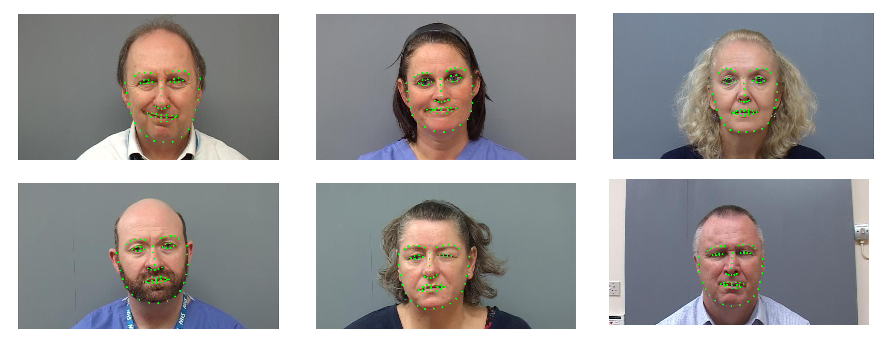

# AFLFP
A Database with Annotated Facial Landmarks for Facial Palsy

## Introduction

<p align = "justify"> 
Facial landmark detection is a crucial step for the task of computer-aided facial palsy diagnosis, which enables to focus on the affected facial regions for learning asymmetry, shape, and texture features of facial palsy. However, it is still very challenging to accurately detect salient landmarks on facial palsy images due to the unavailability of sufficient training databases providing annotated facial landmark images of facial palsy. To this end, we present a database in this article named annotated facial landmarks for facial palsy (AFLFP). AFLFP is a diverse, and reliable database that contains facial images with 16-class facial expressions of asymmetric facial expressions from 88 subjects. Each facial image is independently and manually annotated with 68 facial landmarks.
</p>
<div>

## How to get access to the AFLFP database

This database is publicly available. The user may only use the database for non-commercial academic research. 

Before downloading the database, you need to send an application e-mail to Prof. Hui Yu (<hui.yu@glasgow.ac.uk>) and cc. to <xiayifan@sdu.edu.cn> through a valid academic or institute email account. 

Your Email MUST include the following text with the attachment of the End User License Agreement.

```
Subject: Application to download the AFLFP Database
          
Name: <your first and last name>
Institution: <where you work>
Email: <must be the email at the above mentioned institution>

I have read and agree to the terms specified in the End User License Agreement.
This database will only be used for research purposes.

```
Once the application e-mail is received and approved, you will receive a link to download the database. 

## Citation

To cite the following paper in any publications of yours that makes any use of the AFLFP database:


```
@article{xia2023aflfp,
  title={AFLFP: A database with annotated facial landmarks for facial palsy},
  author={Xia, Yifan and Nduka, Charles and Kannan, Ruben Yap and Pescarini, Elena and Berner, Juan Enrique and Yu, Hui},
  journal={IEEE Transactions on Computational Social Systems},
  volume={10},
  number={4},
  pages={1975-1985},
  year={2023},
  publisher={IEEE}
}
```
